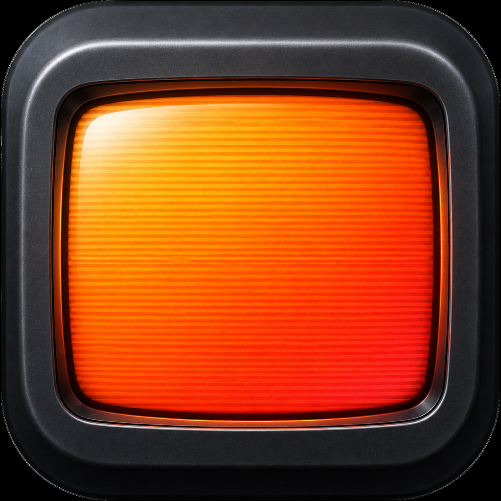

<p align="center">
  
</p>

# RetroPlayer

RetroPlayer 是一款面向老动画与经典 4:3 影像的原生 macOS 播放器。它使用
libmpv 直接播放 MKV 等本地文件，并通过可切换的 GPU shader 提供扫描线、
荧光溢出、彩色荫罩、VHS 和黑白电视效果，不做音视频转码。

## 功能

- MKV、Opus、FLAC、ASS 等格式由 libmpv 直接解码
- 自动加载内嵌字幕及同目录下与视频精确同名的字幕，也可将外挂字幕直接拖入播放窗口
- 播放时可选择音轨和字幕轨道，也可一键关闭字幕
- 播放窗口自动贴合视频真实显示比例，不再固定为 4:3 或在画面外留黑边
- 关闭最后一个播放窗口时立即退出应用并停止视频与音频
- 12 种画面模式：保留全部内置效果与社区 Shader，并增加 PVM 20L4、
  PVM 2730 和 Kurozumi BVM 三种无弧度 Sony CRT 风格
- 支持导入 mpv User Shader（`.glsl`），切换后即时生效并记住选择
- 拖放视频、进度控制、音量控制及原生 macOS 文件选择器
- 默认音量 100%

社区 Shader 来自经过实际 libmpv OpenGL 兼容性验证的
[`hhirtz/mpv-retro-shaders`](https://github.com/hhirtz/mpv-retro-shaders) 与
[`bloc97/Anime4K`](https://github.com/bloc97/Anime4K)。CRT-Royale、Aperture、
GDV 等 gpu-next 专用移植版未直接内置，避免在当前渲染后端中黑屏。

Sony CRT 风格预设参考了开源社区的 Sony Megatron PVM 参数、
CRT-Royale Kurozumi 和 Guest Advanced Trinitron 方向，并针对 RetroPlayer 的
OpenGL 后端重新实现。它们是非官方视觉模拟，与 Sony 无隶属关系。

## 快捷键

- `⌘O`：打开影片
- `Space`：播放 / 暂停
- `←` / `→`：后退 / 前进 10 秒
- `↑` / `↓`：音量增加 / 减少 5%

## 环境要求

- Apple Silicon Mac
- macOS 26

GitHub Release 中的应用已经内置 libmpv 及其动态库依赖，直接运行不需要安装
Homebrew 或 mpv。

## 运行

从源码运行或打包时，需要完整安装 Xcode 26，并安装开发依赖：

```bash
brew install mpv
```

```bash
swift run RetroPlayer
```

也可以在 Xcode 中打开 `Package.swift`，选择 `RetroPlayer` scheme 后运行。

如果 `xcode-select -p` 仍指向 Command Line Tools，请在 Xcode 设置中选择完整
Xcode 工具链，或运行：

```bash
sudo xcode-select -s /Applications/Xcode.app/Contents/Developer
```

## 打包

```bash
zsh scripts/package_app.sh
```

应用会生成在 `outputs/RetroPlayer.app`。打包脚本会递归收集 libmpv 及其
Homebrew 动态库依赖，复制到 `Contents/Frameworks` 并重写为应用内部链接，
同时将可用的第三方许可文本放入 `Contents/Resources/Licenses`。

脚本使用 ad-hoc 本地签名，适合开发测试；公开分发仍需 Apple Developer ID
签名与公证。

## 开源许可

RetroPlayer 自有代码使用 [MIT License](LICENSE)。第三方组件说明见
[THIRD_PARTY_NOTICES.md](THIRD_PARTY_NOTICES.md)。自包含应用包还包含使用
GPL/LGPL 等许可证的动态库；应用内附带相应许可文本。
